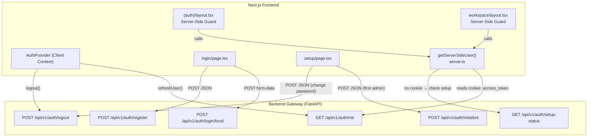

The user is asking about the frontend authentication system, specifically:
1. Login and registration steps
2. Whether it uses middleware
3. A full explanation of the auth flow

Let me start by examining the auth-related files to understand the authentication implementation. I should look at:
- The login page (currently open)
- The setup page (likely for registration)
- The auth layout
- Any middleware files
- Auth-related components and hooks

Let me read these files to get a comprehensive understanding.
I'll examine the frontend authentication system for you. Let me start by reading the relevant auth files in parallel.
Good, I've got the main auth pages. Now let me look for:
1. Middleware file (typically at src/middleware.ts or in the root)
2. AuthProvider
3. Auth server-side functions
4. Auth types
5. Any other auth-related files

Let me search for these files in parallel.
Now let me check for middleware, AuthProvider, and the core auth modules:
Now let me read the server.ts file to understand the server-side auth logic, and also check for any API routes related to auth:
Let me also check the server-side auth logic and look for any auth-related API routes in the frontend:
Now I have a comprehensive picture of the authentication system. Let me also check if there's a root middleware file (Next.js convention is `src/middleware.ts` or just `middleware.ts` in the root):
Let me check for a root-level middleware and look at the app structure for workspace pages:
Interesting, the workspace pages don't seem to use the auth hooks. Let me check the workspace layout and pages more carefully to understand how they protect routes:
Hmm, the workspace layout doesn't seem to use auth directly. Let me check the workspace layout file specifically:
-
Now I have a complete picture of the authentication system. Let me also check if there's a static-mode file to understand the full context:
Now I have the complete picture. Here is my **full analysis** of the frontend authentication system:

---

## DeerFlow Frontend Authentication — Full Explanation

### 1. Does It Use Middleware?

**No, there is NO Next.js middleware (`middleware.ts`) in this project.** I searched thoroughly — no `middleware.ts` exists anywhere in `src/` or at the project root.

Instead, route protection is done via **Server-Side Rendering (SSR) guards in Layout components**, which is actually more robust than middleware for this use case.

---

### 2. Architecture Overview (Mermaid Diagram)



---

### 3. Auth Flow Step-by-Step

#### Phase 0: Server-Side Auth Check (`getServerSideUser()`)

This function in `src/core/auth/server.ts` (lines 15–106) is the **single source of truth for SSR authentication**:

```15:35:g:\tempDelete\deer-flow-main\deer-flow-main\frontend\src\core\auth\server.ts
export async function getServerSideUser(): Promise<AuthResult> {
  if (isStaticWebsiteOnly()) {
    return { tag: "authenticated", user: STATIC_WEBSITE_USER };
  }

  if (process.env.DEER_FLOW_AUTH_DISABLED === "1") {
    return { tag: "authenticated", user: { id: "e2e-user", email: "e2e@test.local", system_role: "admin", needs_setup: false } };
  }
  
  const cookieStore = await cookies();
  const sessionCookie = cookieStore.get("access_token");
  // ... validates against FastAPI gateway ...
}
```

It returns a **tagged union** (`AuthResult`) with these possible states:
| Tag | Meaning | Action |
|-----|---------|--------|
| `"authenticated"` | Valid session cookie + valid user | Render protected page |
| `"needs_setup"` | User logged in but must change password | Redirect to `/setup` |
| `"system_setup_required"` | No users exist yet | Redirect to `/setup` (init admin mode) |
| `"unauthenticated"` | No session / invalid session | Redirect to `/login` |
| `"gateway_unavailable"` | Backend unreachable | Show error page |
| `"config_error"` | Missing env config | Throw error |

#### Phase 1: Route Protection via Layouts (NOT Middleware)

Two layouts act as auth guards:

**(A) Workspace Layout** — `src/app/workspace/layout.tsx` (lines 12–62):
```12:21:g:\tempDelete\deer-flow-main\deer-flow-main\frontend\src\app\workspace\layout.tsx
export default async function WorkspaceLayout({ children }) {
  const result = await getServerSideUser();

  switch (result.tag) {
    case "authenticated":
      return <AuthProvider initialUser={result.user}><WorkspaceContent>{children}</WorkspaceContent></AuthProvider>;
    case "needs_setup": redirect("/setup");
    case "system_setup_required": redirect("/setup");
    case "unauthenticated": redirect("/login");
    // ... gateway_unavailable, config_error handled separately
  }
}
```

**(B) Auth Layout** — `src/app/(auth)/layout.tsx` (lines 11–46):
- Already authenticated? → Redirect to `/workspace`
- Needs setup? → Allow through (with `initialUser`)
- Unauthenticated or system needs setup? → Allow through (with `initialUser=null`)
- Gateway unavailable? → Show error UI

#### Phase 2: Login Page — `src/app/(auth)/login/page.tsx`

The login page handles **both login AND registration** on the same page (toggleable):

```90:128:g:\tempDelete\deer-flow-main\deer-flow-main\frontend\src\app\(auth)\login\page.tsx
const handleSubmit = async (e: React.FormEvent) => {
  const endpoint = isLogin ? "/api/v1/auth/login/local" : "/api/v1/auth/register";
  const body = isLogin
    ? `username=${encodeURIComponent(email)}&password=${encodeURIComponent(password)}`
    : JSON.stringify({ email, password });

  const res = await fetch(endpoint, { method: "POST", headers, body, credentials: "include" });
  // On success → server sets HttpOnly cookie → redirect to workspace
};
```

Key details:
- Login uses **form-urlencoded** format (for compatibility with OAuth2-style endpoints)
- Register uses **JSON**
- Both use `credentials: "include"` to receive HttpOnly session cookies
- Supports `?next=` parameter for post-login redirect (with open-redirect protection via `validateNextParam()`)
- Auto-checks `setup-status` on mount; redirects to `/setup` if system has zero users

#### Phase 3: Setup Page — `src/app/(auth)/setup/page.tsx`

This page has **two modes** depending on state:

| Mode | Triggered By | What It Does |
|------|-------------|-------------|
| `"init_admin"` | System has **zero users** | Creates first admin account via `POST /api/v1/auth/initialize` |
| `"change_password"` | User has `needs_setup=true` (e.g., first login after init) | Changes password via `POST /api/v1/auth/change-password` (requires CSRF headers) |

```32:61:g:\tempDelete\deer-flow-main\deer-flow-main\frontend\src\app\(auth)\setup\page.tsx
useEffect(() => {
  if (isAuthenticated && user?.needs_setup) {
    setMode("change_password");       // Already logged in, needs password change
  } else if (!isAuthenticated) {
    // Check if system has no users yet
    fetch("/api/v1/auth/setup-status")
      .then(data => data.needs_setup ? setMode("init_admin") : router.push("/login"));
  } else {
    router.push("/workspace");         // All good, go to workspace
  }
}, [isAuthenticated, user, router]);
```

#### Phase 4: Client-Side Auth State — `AuthProvider`

`src/core/auth/AuthProvider.tsx` provides React context for client-side auth awareness:

- Holds only **display info** (`User` object), never JWTs/tokens (security best practice)
- Receives `initialUser` from SSR layout (prevents hydration flicker)
- Exposes `logout()`, `refreshUser()`, `isAuthenticated`
- Auto-refreshes user when browser tab becomes visible again (throttled to once per 60s)
- Provides `useRequireAuth()` hook for additional client-side guard checks

#### Phase 5: Logout Flow

1. Client calls `/api/v1/auth/logout` (POST)
2. Backend clears the `access_token` HttpOnly cookie
3. Client immediately sets `user = null` locally (optimistic update)
4. Redirects to home page `/`

---

### 4. Security Measures Summary

| Mechanism | Where |
|-----------|-------|
| **HttpOnly session cookies** | Backend sets `access_token` cookie; frontend never reads it |
| **Open-redirect prevention** | `validateNextParam()` rejects non-relative URLs |
| **CSRF protection** | Change-password endpoint requires `getCsrfHeaders()` |
| **SSR route guards** | Layout-level `getServerSideUser()` checks before rendering |
| **No token in localStorage** | AuthProvider only stores display info |
| **Zod validation** | All backend responses validated with schemas |
| **Gateway timeout** | SSR auth requests have 5-second timeout |
| **Static/E2E bypass** | Respects `DEER_FLOW_AUTH_DISABLED` and static mode flags |

---

### 5. Key Takeaway: Why No Middleware?

This project deliberately uses **layout-based SSR guards instead of Next.js middleware** because:

1. **Layouts have full access to `cookies()`, `fetch()`, and `redirect()`** from `next/navigation` — same primitives as middleware
2. **Layouts can render different UI per state** (e.g., error/retry screen for `gateway_unavailable`)
3. **Layouts pass initial state to client** via `AuthProvider initialUser`, preventing flicker
4. **Simpler debugging** — logic lives right next to the routes it protects

The trade-off: you need to add the guard to each layout group manually (they did this for `(auth)` and `workspace`), whereas middleware would automatically cover all routes. But for this app's structure, the layout approach is cleaner and more explicit.